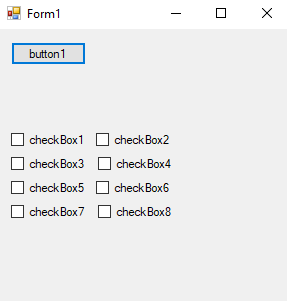
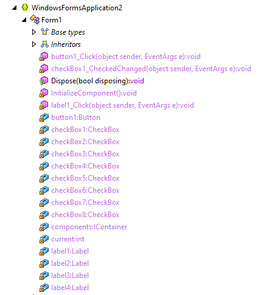

# Solve GUI I
##### https://cybertalents.com/challenges/malware/gui-i
Try to run the exe 


The program works as a calculator each checkBox has a value can be determine with this eqation `checkBox value  = 2^(n-1)` where n = number of the check box [1-8]. The button perform eavaluation process for one checkBox and a sumation process for more than one and print the output.

Get the file info via `exiftool GUI.exe`
*You can find the output in Info file* 
Dump file strings with `strings GUI.exe`
*You can find the output in strings file* 
Via analyzing strings file we found interesting keywords.
```
NETFramework,Version=v4.5
FrameworkDisplayName
.NET Framework 4.5
Visual Studio 2012
```
Also XML code that exposes versions and user privileges.

With information from the past 3 tests the program most likely to be written in `C#`.

### Analyze the file with dotPeek:
 

in the main function we found : 
4 labels the interesting one is label3 as This label is used to display a sequence of numbers separated by spaces. It's declared as a private member variable and initialized in the `InitializeComponent` method. The Text property of this label is set to a string containing numbers in the `label3_Click` event handler. **However, it's set to be invisible (Visible = false) in the provided code.**
Values of `label3`:
`this.label3.Text = "92 98 87 93 113 95 105 85 106 94 95 105 85 89 87 91 105 87 104 85 89 95 102 94 91 104 53 115";`

with the numbers we found that they are close to format of `flag{...}` if we convert them from decimal to ascii add 10 to each number.

By combining and reversing the `label3` values with python we get the key.
*You can find the script in Rev.py file*

>Find More on ==> github.com/MedhatHassan