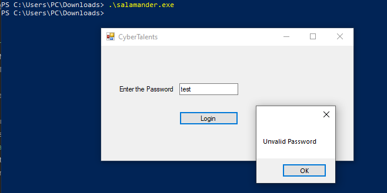

# Solve salamander.exe
#### https://cybertalents.com/challenges/malware/salamander.exe

### Try to run

Get the file info via `exiftool salamander.exe`
*You can find the output in [Info](Info.txt) file* 
Dump file strings with `strings salamander.exe`
*You can find the output in [strings](Strings.txt) file* 
Via analyzing strings file we found interesting keywords.
```
.NET Framework 4.7.2
C:\Users\moham\source\repos\Challenge\Challenge\obj\Release\Challenge.pdb
_CorExeMain
mscoree.dll
<?xml version="1.0" encoding="UTF-8" standalone="yes"?>
<assembly xmlns="urn:schemas-microsoft-com:asm.v1" manifestVersion="1.0">
  <assemblyIdentity version="1.0.0.0" name="MyApplication.app"/>
  <trustInfo xmlns="urn:schemas-microsoft-com:asm.v2">
    <security>
      <requestedPrivileges xmlns="urn:schemas-microsoft-com:asm.v3">
        <requestedExecutionLevel level="asInvoker" uiAccess="false"/>
      </requestedPrivileges>
    </security>
  </trustInfo>
</assembly>
```

We found that the program developed in C# .NET

### Analyze with dotPeek

We found the flag in the source code
*you can view the source in [source.cs](source.cs)*

>Find More on ==> github.com/MedhatHassan 
