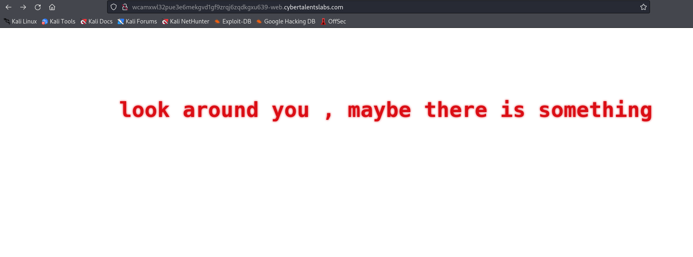
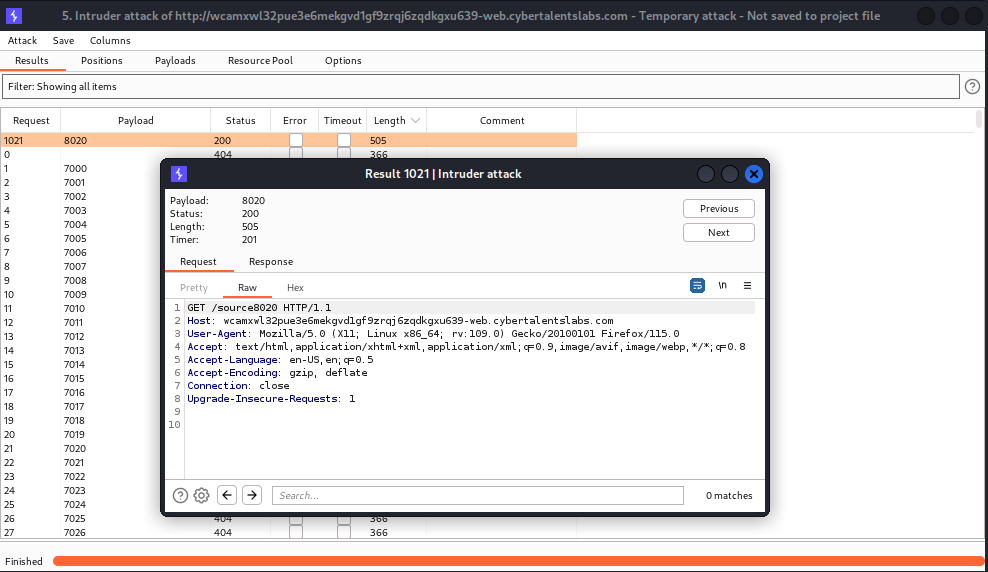

# Solve concmarks
#### https://cybertalents.com/challenges/web/concmarks



### Run Directory bruteforce
`dirsearch -u http://wcamxwl32pue3e6mekgvd1gf9zrqj6zqdkgxu639-web.cybertalentslabs.com -x 403,404`
*you can find the output in [Directories.txt](Directories.txt)*

In the source code we found:
```html
<!--FILE=> sourceXXXX -->
<!--XXXX are numbers > 7000 & < 9000 -->
```



### Bruteforce attack to find the source file
```php
include('flag.php');	


if( @$_GET['n1'] && @$_GET['n2'] )
{
	$input1 = $_GET['n1'];
	$input2 = $_GET['n2'];
	if( $input1 !== $input2 && @hash("md5", $salt.$input1) === @hash("md5", $salt. $input2) )
	{
		echo $flag;

	} else {

		echo "Sorry this value not valid.";
	}
} else{
	exit();
}

```

### Code breakdown
`$input1 !== $input2`: Ensures that the values of n1 and n2 are not the same.
`@hash("md5", $salt.$input1) === @hash("md5", $salt. $input2)`: Checks if the MD5 hash of input1 concatenated with `$salt` is equal to the MD5 hash of input2 concatenated with `$salt`.

### Try to pass the values to flag.php

`curl "http://wcamxwl32pue3e6mekgvd1gf9zrqj6zqdkgxu639-web.cybertalentslabs.com/flag.php?n1=test&n2=test2"`

>Find More on ==> github.com/MedhatHassan 
